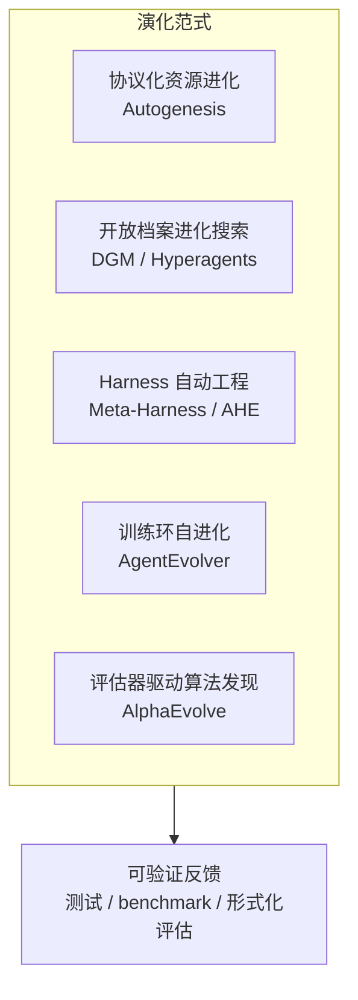

# 自进化架构调研报告（2025.12 — 2026.06）

> **范围**：以 2026-06-02 为基准，回溯近六个月（约 2025-12 至 2026-06）发表的论文、预印本与代表性工程博客。  
> **主题**：让 AI Agent / LLM 系统在运行或迭代中**自主修改自身**——包括 prompt、工具、协调结构、harness 代码、甚至模型权重——的架构与方法。  
> **分类维度**：按**演化思想**（evolutionary paradigm）组织，而非按机构或发布时间。

---

## 一、领域概览

### 1.1 从「静态 Agent」到「自进化系统」

传统 Agent 栈（模型 + prompt + 工具 + 编排）在部署后基本固定。近半年研究的核心转向是：

| 演化对象 | 典型问题 |
|---------|---------|
| **What** | 改什么？prompt / tool / memory / harness 代码 / 权重 / 多 Agent 拓扑 |
| **When** | 何时改？单任务 test-time / 跨任务 inter-test / 离线训练循环 |
| **How** | 怎么改？反思文本反馈 / 标量 reward / 进化搜索 / 协议化 commit-rollback |

权威综述 [A Survey of Self-Evolving Agents](https://arxiv.org/abs/2507.21046)（Gao et al., 2025，v4 持续更新）用 **What / When / How** 三维框架统一了该领域；本报告在其基础上，按**架构演化范式**做工程向细分。

### 1.2 近六个月的技术主线（五条）



**共同前提**：自进化在**有可验证反馈**的领域进展最快（代码测试、benchmark 通过率、算法正确性证明、调度延迟等）。纯自然语言自评易陷入「自洽幻觉」，生产系统普遍引入**外部评估器 + 沙箱 + 回滚**。

### 1.3 与既有笔记的关系

你已有的 [[Agent Harness Survey]] 聚焦 **Context / Harness 短期优化**（prompt 标定、JIT 检索、KV-cache 等）。本报告覆盖更广的**全栈自进化架构**，二者互补：前者是 harness 的**手工/半自动工程**；后者是 harness（及更多组件）的**自动演化机制**。

---

## 二、分类调研

---

## 范式 A：协议化资源进化（Protocol-First Evolution）

> **核心思想**：把「可被进化的实体」和「进化算子」解耦，用**协议层**规定生命周期、版本、审计与回滚，避免单体 Agent 里硬编码演化逻辑。

### A.1 Autogenesis Protocol (AGP) / Autogenesis System (AGS)

| 项 | 内容 |
|----|------|
| **来源** | Zhang et al., *Autogenesis: A Self-Evolving Agent Protocol*, arXiv:[2604.15034](https://arxiv.org/abs/2604.15034), 2026-04（ICML 2026 submission） |
| **博客** | [Flowtivity 解读](https://flowtivity.ai/blog/autogenesis-self-evolving-agent-protocol/)；[治理视角 Medium](https://medium.com/@michael.hannecke/when-agents-improve-themselves-why-self-evolution-without-sovereignty-is-a-governance-blind-spot-32ee11a72c0f) |

**Main Idea**

- **RSPL（Resource Substrate Protocol Layer）**：将 prompt、agent、tool/MCP/skill、environment、memory 建模为**协议注册资源**，具备显式 state、lifecycle、versioned interface。
- **SEPL（Self-Evolution Protocol Layer）**：五算子闭环 **Reflect → Select → Improve → Evaluate → Commit**，对资源变更产生可审计 lineage，支持 rollback。
- **AGS 实例化**：多 Agent 通过 **Agent Bus** 解耦通信；演化与任务执行交错，trace 暴露失败时触发 SEPL，成功 commit 的资源在后续 bus round 全局可见。

**设计权衡**

| 优势 | 代价 |
|------|------|
| 演化与实现解耦，可插拔优化器（如 reflection optimizer） | 协议设计与落地成本高，需全链路遵守 RSPL |
| 版本/回滚适合生产与合规 | 相对 MCP/A2A 多一层治理语义，生态尚在形成 |
| Bus 模型便于替换单个 agent 而不破坏系统 | 性能与调试复杂度高于单体 pipeline |

**实现方式**

1. 所有可进化 artifact 注册为 RSPL 资源，变更走 SEPL 而非 ad-hoc 改文件。  
2. Planner + sub-agents 仅通过 bus message 交互。  
3. **Algorithm 1（Reflection Optimizer）**：读 execution trace → 因果失败假设 → 生成 prompt/tool/MCP/skill 补丁 → Evaluate 后 Commit。  
4. Benchmark：GPQA、HLE、LeetCode 等长程工具任务，相对强 baseline 持续提升。

**与其他范式关系**：可视为在 **MCP/A2A 连接层之上**增加「进化安全更新」层；治理博客强调需配合 **operator sovereignty**（谁有权 commit/rollback），而非仅技术 rollback。

---

## 范式 B：开放档案进化搜索（Open-Ended Archive Evolution）

> **核心思想**：维护**多样 Agent 档案**，分支、变异、评估、入库；避免只沿单一「当前最优」爬山导致局部最优。

### B.1 Darwin Gödel Machine (DGM)

| 项 | 内容 |
|----|------|
| **来源** | Zhang et al., arXiv:[2505.22954](https://arxiv.org/abs/2505.22954), 2025-05；[Sakana 博客](https://sakana.ai/dgm/) |
| **代码** | [jennyzzt/dgm](https://github.com/jennyzzt/dgm) |
| **时间说明** | 略早于本报告 6 个月窗口，但是 **Hyperagents、SIA** 等的直接基线，保留为范式锚点。 |

**Main Idea**

- 冻结 FM 权重，进化对象是 **coding agent 的全部 Python 实现**（工具、工作流、patch 验证等）。
- **自修改 + 实证验证**：每轮用 SWE-bench / Polyglot 评估，**无形式化证明**，靠 benchmark 筛选。
- **开放档案**：从档案中选父代分支，而非总从最新版变异；保留「有趣但非当前最优」的 stepping stones。

**设计权衡**

| 优势 | 代价 |
|------|------|
| SWE-bench 20%→50%（~80 iter）等强实证 | 计算昂贵；需沙箱与修改可追溯 |
| 可发现非直觉改进（多解排序、失败历史等） | 仅适用于 coding 等可测域；FM 不训练 |
| 档案避免早熟收敛 | 安全依赖 sandbox，非形式化保证 |

**实现方式**

1. `DGM_outer.py` 驱动外循环：选父 agent → LLM 提议代码 diff → 跑 benchmark → 入库。  
2. `coding_agent.py` 为初始 agent；`tools/`、`prompts/` 可被改写。  
3. 与「每轮只改当前最优」baseline 对比，档案机制显著更优。

---

### B.2 Hyperagents / DGM-Hyperagents (DGM-H)

| 项 | 内容 |
|----|------|
| **来源** | Zhang et al., *Hyperagents*, arXiv:[2603.19461](https://arxiv.org/abs/2603.19461), 2026-03（ICLR 2026） |
| **代码** | [facebookresearch/HyperAgents](https://github.com/facebookresearch/HyperAgents) |
| **博客** | [Verdent 解读](https://www.verdent.ai/guides/meta-hyperagents-ai-coding) |

**Main Idea**

- **Hyperagent** = task agent + meta agent **合并为单一可编辑程序**；meta 的「如何改」本身也可被改 → **元认知自修改（metacognitive self-modification）**。
- **DGM-H** 在 DGM 档案框架上，允许修改 self-improvement 机制（如持久记忆、性能跟踪），且 meta 改进可**跨域迁移**（coding → paper review → robotics）。

**设计权衡**

| 优势 | 代价 |
|------|------|
| 突破 DGM「coding 能力≈自改能力」的对齐假设 | 搜索空间更大，稳定性更难分析 |
| meta 层改进可累积、可迁移 | 需更强 sandbox 与评估多样性 |
| 理论上面向任意可计算任务 | 实验仍以可测任务为主 |

**实现方式**

1. 单文件 `hyperagent.py` 含任务与 meta 逻辑。  
2. 外循环同 DGM：branch → self-modify → evaluate → archive。  
3. 对比：无自进化 / 无开放探索 / 仅 DGM（meta 固定）/ DGM-H。

---

## 范式 C：自指涉代码改写（Self-Referential Code Mutation）

> **核心思想**：Agent **直接编辑自身代码库**；meta/target 边界消融或折叠，形成「自己改自己」闭环。

### C.1 SICA (Self-Improving Coding Agent)

| 项 | 内容 |
|----|------|
| **来源** | Robeyns et al., arXiv:[2504.15228](https://arxiv.org/abs/2504.15228), 2025-04；[GitHub](https://github.com/MaximeRobeyns/self_improving_coding_agent) |
| **时间说明** | 略早于 6 个月窗口；与 ADAS 并列，是**自指涉**路线的代表实现。 |

**Main Idea**

- **消除 meta-agent 与 target-agent 区分**：archive 中**最优历史 agent** 既执行任务，又修改自身代码。
- 循环：benchmark 当前版 → 存档 → 在**自己代码库**上提出改进 → 再评估。
- SWE-Bench Verified 子集：17% → 53%（约 15 iter）；同时优化成本与速度。

**设计权衡**

| 优势 | 代价 |
|------|------|
| 实现简单（纯 Python，无 DSL） | 无固定 meta，行为更难预测 |
| 可改整个 codebase（工具、LSP、推理结构） | 强依赖 benchmark 防退化 |
| 相对 ADAS：meta 也是「过去的自己」 | 安全与权限边界需工程约束 |

**实现方式**

1. `base_agent` 极简起步，靠自改 bootstrap 工具链。  
2. Archive 存 `(code, metrics)`；每轮从 best@archive 出发 meta-improve。  
3. 与 ADAS 对比：ADAS meta 固定，只改 target 的 forward；SICA **全栈自指涉**。

---

### C.2 SIA (Self-Improving AI: Harness & Weight Updates)

| 项 | 内容 |
|----|------|
| **来源** | Hebbar et al., arXiv:[2605.27276](https://arxiv.org/abs/2605.27276), 2026-05；[hexo-ai/sia](https://github.com/hexo-ai/sia)（MIT） |
| **报道** | [MarkTechPost](https://www.marktechpost.com/2026/05/29/hexo-labs-open-sources-sia-a-self-improving-agent-that-updates-both-the-harness-and-the-model-weights/) |

**Main Idea**

- 在**同一自进化环**中，由 **Feedback-Agent** 根据完整 trajectory **二选一**：  
  - **SIA-H**：只改 harness（prompt、tool dispatch、retry、answer extraction）；  
  - **SIA-W+H**：再触发 **LoRA 权重更新**（rank 32 等）。
- Meta-Agent 初始化 scaffold；Task-Agent 执行；Feedback-Agent 选杠杆。

**设计权衡**

| 优势 | 代价 |
|------|------|
| 首次系统性地联合优化 scaffold + weights | 权重更新算力与数据需求高 |
| 权重更新可补 prompt 无法表达的领域知识 | Feedback 策略目前为 frozen LLM，非最优 attribution |
| LawBench +56.6%、TriMul 内核 -91.9% runtime 等 | 作者承认 algorithm 选择可更 principled（meta-RL 为 future work） |

**实现方式**

1. CLI：`--max_gen` 控制代数；`--backend` claude/openhands。  
2. 每代：跑 task → 日志 → Feedback-Agent 决策 → 改 harness 或跑 fine-tune。  
3. 论文划分 **Silo 1（仅 harness）** vs **Silo 2（RL/权重）**；SIA 横跨两 silo。

---

## 范式 D：Harness 自动工程（Harness as Evolvable Code）

> **核心思想**：模型权重固定，把 **harness**（上下文组装、工具编排、中间件、记忆）当作**可搜索的代码工件**；用 execution trace 作反馈，而非压缩成标量。

### D.1 Meta-Harness

| 项 | 内容 |
|----|------|
| **来源** | Lee et al., arXiv:[2603.28052](https://arxiv.org/abs/2603.28052), 2026-03；[项目页](https://yoonholee.com/meta-harness/) |

**Main Idea**

- **Outer loop** 搜索 harness **源代码**；proposer 是 **coding agent**（非固定模板反思）。
- **Filesystem 反馈通道**：每候选 harness 对应目录（源码、分数、完整 trace）；proposer 用 `grep`/`cat` 按需读取，单次评估可达 **~10M token** 诊断信息。
- 任务：在线文本分类、RAG 数学（IMO）、**TerminalBench-2** agentic coding。

**设计权衡**

| 优势 | 代价 |
|------|------|
| 比 ACE 等文本优化器多 3 个数量级反馈 | 依赖 2026 前后强 coding agent 才实用 |
| TerminalBench-2 超人工 Terminus 等 baseline | 搜索成本高 |
| 单 harness 可迁移到 5 个 held-out 模型（+4.7pp 数学） | 主要验证在特定 benchmark 生态 |

**实现方式**

1. 迭代：proposer 读 $\mathcal{D}$ 中历史 → 诊断 failure mode → 写新 harness 代码 → 评估入库。  
2. 与「标量 score + 短 summary」baseline 对比。  
3. 与 AHE 为**同期并发工作**（论文互相引用）。

---

### D.2 Agentic Harness Engineering (AHE)

| 项 | 内容 |
|----|------|
| **来源** | Lin et al., arXiv:[2604.25850](https://arxiv.org/abs/2604.25850), 2026-04；[GitHub](https://github.com/china-qijizhifeng/agentic-harness-engineering) |
| **博客** | [Dawning Road（中英）](https://dawning-road.github.io/blog/agentic-harness-engineering) |

**Main Idea**

- **可观测性驱动**的 `evaluate → analyze → improve` 闭环；**base model 冻结**。  
- 三大支柱：  
  1. **Component observability**：每个 harness 组件文件化、可 revert；  
  2. **Experience observability**：百万级 trajectory token 蒸馏为分层证据库；  
  3. **Decision observability**：每次编辑附带**可证伪预测**，下轮任务级验证。

**设计权衡**

| 优势 | 代价 |
|------|------|
| 10 iter：Terminal-Bench 2 69.7%→77.0%，超 Codex CLI / ACE / TF-GRPO | 需完整 observability 栈建设 |
| 冻结 harness 可跨模型族迁移（+5.1~+10.1pp） | 消融显示增益在 tool/middleware/memory，非 system prompt |
| 把 harness 工程从「改 prompt」升级为「改系统」 | 与 Meta-Harness 路线重叠，选型需看团队栈 |

**实现方式**

1. NexAU-AHE 等实现；组件含 prompts、tools、middleware、skills、sub-agents、长期记忆。  
2. 每轮 manifest / DECISIONS 式决策记录（与 Lin 博文及 David Reed 的 PACCA 实践呼应）。  
3. Leaderboard：GPT-5.5 上 TB2 **84.7%**（2026-05 报）。

---

### D.3 Harness Engineering（工程范式博客，非单篇论文）

| 来源 | 要点 |
|------|------|
| [OpenAI: Harness Engineering](https://openai.com/index/harness-engineering/)（2026-03） | Agent-first 世界中，**harness 是可版本化、可迭代的工程对象** |
| [Anthropic: Harness design for long-running apps](https://www.anthropic.com/engineering/harness-design-for-long-running-apps)（2026-03） | GAN 式三 Agent + sprint contract；模型**不能可靠自评**，需 harness 提供外部评判 |
| [David Reed: Stop Iterating Prompts](https://drdavidreed.com/blog/harness-engineering-production-agentic-ai/) | JSON Schema manifest、`harness-iter-0` 基线、每 commit 一条可审计决策 |
| [Epsilla: Third Evolution](https://www.epsilla.com/blogs/harness-engineering-evolution-prompt-context-autonomous-agents) | Prompt → Context → **Harness** 三阶段论 |
| [Latent Space: Harness as Environment](https://jaesolshin.com/posts/harness-layer/) | Harness = 记忆层下面的**适应机制**（可观测、可回滚、可晋升 skill） |
| [Aakash Gupta: 2026 is Agent Harnesses](https://aakashgupta.medium.com/2025-was-agents-2026-is-agent-harnesses-heres-why-that-changes-everything-073e9877655e) | 竞争壁垒从模型转向 harness（编排、子 Agent、生命周期 hook） |

**Main Idea（归纳）**

- **Harness** = 围绕 LLM 调用的全部确定性逻辑：工具、状态、约束、评估 hook、上下文策略。  
- 2026 共识：**Agents aren't hard; the Harness is hard**；自进化应优先演化 harness，而非堆 prompt。

**设计权衡**

| 优势 | 代价 |
|------|------|
| 可审计、可回归，适合医疗/金融等 | 前期基础设施重 |
| 与模型升级解耦 | 过度约束可能限制 Agent 创造性 |
| 失败转化为 ratchet（hook / AGENTS.md 条目） | 组织需「Harness Engineer」角色 |

**实现方式（实践清单）**

- 固定 `harness-iter-N` 标签 + 结构化 trajectory 日志。  
- 行为变更必须对应 manifest 条目或显式 opt-out。  
- 外部 evaluator（测试、linter、人审）替代模型自评。  
- 小步 promotion：成功模式 → skill library；失败 → 回滚单元要小。

---

## 范式 E：训练环自进化（Environment → Policy Co-Evolution）

> **核心思想**：在 **RL / 自生成数据** 框架下，同时进化**任务分布、探索策略、信用分配**，降低人工数据集成本。

### E.1 AgentEvolver

| 项 | 内容 |
|----|------|
| **来源** | Zhai et al., arXiv:[2511.10395](https://arxiv.org/abs/2511.10395), 2025-11；[modelscope/AgentEvolver](https://github.com/modelscope/AgentEvolver) |

**Main Idea**

三机制对齐训练流 **环境→任务→轨迹→策略**：

| 机制 | 作用 |
|------|------|
| **Self-Questioning** | 好奇心驱动自动造任务，减手工数据集 |
| **Self-Navigating** | 跨任务经验复用，混合策略引导 rollout |
| **Self-Attributing** | 长轨迹上细粒度 credit（ADCA-GRPO），提高样本效率 |

**设计权衡**

| 优势 | 代价 |
|------|------|
| AppWorld / BFCL 上 7B 模型大幅提升 | 需完整 env service + RL 栈 |
| 三机制可消融组合 | 不如代码自改直观可解释 |
| 面向 continual policy 改进 | 部署仍要防分布外退化 |

**实现方式**

```bash
python launcher.py --conf examples/overall.yaml --with-appworld --with-reme
```

- Task Manager / Experience Manager / Advantage Processor 等模块。  
- 2025-12 延伸：**CuES**（[2512.01311](https://arxiv.org/abs/2512.01311)）扩展 self-questioning。

---

## 范式 F：评估器驱动的算法/科学发现（Evaluator-Gated Evolution）

> **核心思想**：在**形式化或客观指标**可算的领域，用 LLM 作变异算子、用自动评估作选择压力，进化**整个代码库**而非单函数。

### F.1 AlphaEvolve

| 项 | 内容 |
|----|------|
| **来源** | Novikov et al., arXiv:[2506.13131](https://arxiv.org/abs/2506.13131), 2025-06；[DeepMind 博客](https://deepmind.google/blog/alphaevolve-a-gemini-powered-coding-agent-for-designing-advanced-algorithms/) |
| **时间说明** | 略早于 6 个月，但 2026 初仍被反复引用为 **RSI 产业案例** |

**Main Idea**

- 用户给 **初始程序 + evaluator**；Gemini Flash（广度）+ Pro（深度）提议变异；自动化沙箱打分；**程序库（MAP-Elites 等）** 平衡探索/利用。  
- 已用于：数据中心调度、TPU 电路简化、**矩阵乘法 4×4 复数 48 次乘法**（56 年来首次改进 Strassen 设定）等。

**设计权衡**

| 优势 | 代价 |
|------|------|
| 可证明正确 + 可测性能双重要求 | 问题必须能写成 evaluator |
| 生产级 Google 基础设施落地 | 细节多属工业白盒，复现门槛高 |
| 间接 RSI：优化 Gemini 训练内核 → 更好 mutation | 循环慢（月级），非在线改权重 |

**实现方式**

1. 进化 pipeline：generate → execute → score → select parents。  
2. 相对 FunSearch：从单函数到**多文件 codebase**。  
3. 与 Agent 自进化的区别：目标常是**人类定义的算法问题**，而非 Agent 脚手架自身。

---

## 范式 G：架构哲学与「智能驱动」设计（Architecture-as-Guidance）

> **核心思想**：不强调自动改代码，而定义**可被智能体动态组合**的架构边界（能力空间、协议、人机协同）。

### G.1 Intelligence-Driven Architecture (IDA)

| 来源 | [Enginyyr: IDA](https://blog.enginyyr.com/posts/intelligence-driven-architecture/)（2025-2026） |
|------|------|

**Main Idea**

- Agent 作为**主 orchestrator**，按高层 intent **发现、组合、执行**能力，而非预定 workflow。  
- MCP 实现「可能性空间」：原子能力 + 智能编排。

**设计权衡**：灵活 vs 可预测；需约束与可观测性补足。  

**实现方式**：MCP server 网格 + 意图级 API + 策略护栏。

### G.2 相关模式（博客归纳）

| 模式 | 来源 | 要点 |
|------|------|------|
| **Orchestrator-Worker** | [ShShell Agentic Architecture](https://shshell.com/blog/agentic-architecture) | 复杂任务分解；合同从 API 变为 goal/prompt |
| **Verification Loop** | 同上 | 生成与评判分离，对抗幻觉 |
| **RGR / OCA / EMA** | IDA 系列文 | 运行时需求精炼、可观测认知架构、执行-进化双环记忆 |

---

## 范式 H：元设计搜索（Meta Agent Search / ADAS）

> **核心思想**：固定 **meta-agent** 在 Turing 完备的代码空间里搜索 **target agent 设计**。

### H.1 ADAS (Automated Design of Agentic Systems)

| 项 | 内容 |
|----|------|
| **来源** | Hu et al., ICLR 2025 Outstanding Paper, arXiv:[2408.08435](https://arxiv.org/abs/2408.08435) |
| **站点** | [shengranhu.com/ADAS](https://www.shengranhu.com/ADAS/) |

**Main Idea**

- Meta Agent Search：meta 写代码定义新 agent → 评估 → 存档 → 指导下一轮。  
- 发现的设计可**跨域、跨模型**迁移。

**设计权衡**

| vs SICA | ADAS meta 固定，搜索 target 设计 | SICA meta=历史最优自己，改全栈 |
| vs DGM | ADAS 更广任务（ARC 等） | DGM 专注 coding agent 自改 |

**实现方式**：Archive + FM 编程 + 双轮 self-reflection 过滤。

---

## 三、横向对比

### 3.1 演化对象与反馈类型

| 工作 | 主要演化对象 | 反馈信号 | 是否改权重 |
|------|-------------|----------|-----------|
| Autogenesis | RSPL 五类资源 | SEPL Evaluate + benchmark | 否（协议层） |
| DGM / DGM-H | Agent 全代码 (+ meta 逻辑) | SWE-bench / Polyglot 等 | 否 |
| SICA | 自身 Python 代码库 | 多 benchmark | 否 |
| SIA | Harness + 可选 LoRA | Task trajectory + 任务指标 | 可选 |
| Meta-Harness / AHE | Harness 源码 | Trace + 任务分数 | 否 |
| AgentEvolver | Policy（LLM） | RL reward + attribution | 是（训练） |
| AlphaEvolve | 算法代码库 | 客观 evaluator | 否（间接改训练栈） |
| ADAS | Target agent 代码 | 域内准确率等 | 否 |

### 3.2 选择决策树（简版）

```
有可验证 evaluator？
├─ 否 → 范式 G（架构约束）+ 人工 harness 迭代
└─ 是
   ├─ 要改模型权重？→ SIA / AgentEvolver
   ├─ 只改编排代码？
   │  ├─ 要协议/合规/多租户 → Autogenesis
   │  ├─ 要开放探索多样解 → DGM / Hyperagents
   │  ├─ 要自指涉单 repo → SICA
   │  └─ 只改 harness → Meta-Harness / AHE
   └─ 科学/算法发现 → AlphaEvolve
```

### 3.3 安全与治理（2026 新兴议题）

- **技术**：沙箱执行、变更 diff 审计、自动 rollback（AGP SEPL Commit 前 Evaluate）。  
- **组织**：[Sovereignty / operator oversight](https://medium.com/@michael.hannecke/when-agents-improve-themselves-why-self-evolution-without-sovereignty-is-a-governance-blind-spot-32ee11a72c0f)：谁可见每次 Reflect、谁批准 Commit、rollback 是否依赖云厂商工单。  
- **ICLR 2026 Workshop on RSI**：从 lab 走向 production 的算法与治理并列议题。

---

## 四、研究空白与建议方向

1. **稳定的多层自进化**：SIA 提出 outer-MDP 学 Feedback-Agent；Hyperagents 改 meta —— 嵌套环路的收敛性仍缺理论。  
2. **Harness 进化 vs Prompt 进化**：AHE 消融表明 system prompt 单独改易回归；工具/中间件/memory 更可迁移。  
3. **跨范式组合**：AGP 资源模型 + Meta-Harness 式 trace 诊断 + AgentEvolver 权重更新。  
4. **生产指标**：除 benchmark 外，需 latency、成本、KV-cache hit、回归率等企业指标进入 Evaluate。  
5. **与 Context Engineering 衔接**：JIT 检索、append-only context（见你方 [[Agent Harness Survey]]）应作为 harness 进化的**约束不变量**，避免进化破坏 cache 与可观测性。

---

## 五、参考文献与链接（按时间）

| 时间 | 类型 | 标题 | 链接 |
|------|------|------|------|
| 2025-11 | 论文 | AgentEvolver | https://arxiv.org/abs/2511.10395 |
| 2025-12 | 论文 | CuES (AgentEvolver 延伸) | https://arxiv.org/abs/2512.01311 |
| 2026-03 | 论文 | Meta-Harness | https://arxiv.org/abs/2603.28052 |
| 2026-03 | 论文 | Hyperagents | https://arxiv.org/abs/2603.19461 |
| 2026-04 | 论文 | Autogenesis | https://arxiv.org/abs/2604.15034 |
| 2026-04 | 论文 | Agentic Harness Engineering | https://arxiv.org/abs/2604.25850 |
| 2026-05 | 论文 | SIA | https://arxiv.org/abs/2605.27276 |
| 2025-07+ | 综述 | Survey of Self-Evolving Agents | https://arxiv.org/abs/2507.21046 |
| 2026-03 | 博客 | OpenAI / Anthropic Harness Engineering | 见范式 D.3 |
| 2026 | Workshop | ICLR RSI Workshop | https://iclr.cc/virtual/2026/workshop/10000796 |

**窗口外但必读基线**：DGM (2505.22954)、SICA (2504.15228)、ADAS (2408.08435)、AlphaEvolve (2506.13131)。

---

## 六、总结

近六个月自进化架构的主线可以概括为：

1. **从 prompt 到 protocol + harness 代码**：Autogenesis、AHE、Meta-Harness 把「可改对象」形式化为资源或源码。  
2. **从单点爬山到档案 + 元认知**：DGM → Hyperagents 扩大搜索且允许改「改法」。  
3. **从 scaffold 到 scaffold+weights**：SIA 证明两杠杆需由数据驱动选择，而非固定 schedule。  
4. **从手工数据集到自造任务+归因**：AgentEvolver 代表训练范式与 Agent 架构演化的合流。  
5. **工程共识**：Harness 是 2026 的主战场；自进化必须以**可观测、可回滚、外部评估**为前提。

若你下一步要在生产环境落地，建议路径：**先建 Harness 可观测基线（范式 D.3）→ 小规模 AHE/Meta-Harness 式闭环 → 再视合规需求引入 AGP 式协议层**。
