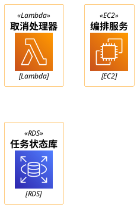

# 环境与渲染

## Windows 安装

不装系统级 JDK，用便携版：

```powershell
$dest = "$env:USERPROFILE\.tools"
New-Item -ItemType Directory -Force -Path $dest | Out-Null
Invoke-WebRequest 'https://api.adoptium.net/v3/binary/latest/21/ga/windows/x64/jdk/hotspot/normal/eclipse' -OutFile "$dest\temurin21.zip" -TimeoutSec 900
Expand-Archive "$dest\temurin21.zip" -DestinationPath "$dest\jdk21"
Remove-Item "$dest\temurin21.zip"
New-Item -ItemType Directory -Force -Path "$dest\plantuml" | Out-Null
Invoke-WebRequest 'https://github.com/plantuml/plantuml/releases/latest/download/plantuml.jar' -OutFile "$dest\plantuml\plantuml.jar" -TimeoutSec 300
```

装完的路径：

```text
java     %USERPROFILE%\.tools\jdk21\jdk-<版本>\bin\java.exe
plantuml %USERPROFILE%\.tools\plantuml\plantuml.jar
```

`winget install EclipseAdoptium.Temurin.21.JDK` 在这台机器上报过 `0x8a150044`（Rest API
终结点找不到），所以走 zip。渲染时 Java 会打印 `Could not open/create prefs root node` 之类
的警告，那是写注册表被拒，不影响出图，忽略即可。

## WSL 安装

WSL 侧要一条 sudo 命令，其余免 sudo：

```bash
sudo apt-get update
sudo apt-get install -y openjdk-21-jre-headless fontconfig fonts-noto-cjk
mkdir -p ~/.tools/plantuml
curl -fsSL -o ~/.tools/plantuml/plantuml.jar \
  https://github.com/plantuml/plantuml/releases/latest/download/plantuml.jar
```

三个包各自解决一个问题：

- `openjdk-21-jre-headless` 提供 JRE。headless 包不带 X11 依赖，正好绕开精简发行版缺 `libXext.so.6` 的问题。
- `fontconfig` 提供字体配置，缺了它 JDK 抛 `Fontconfig head is null`。
- `fonts-noto-cjk` 提供中文字体，缺了它中文标签渲染不出来。

如果改用完整版 JDK（Temurin 压缩包），还要补 `libxext6 libxrender1 libxtst6 libxi6`，或者
渲染时加 `-Djava.awt.headless=true`。只有 headless 还不够，fontconfig 和字体仍然要装。

## 诊断

```bash
ldconfig -p | grep -E 'fontconfig|freetype'   # 两条都空 = 依赖没装
which fc-cache                                 # 找不到 = fontconfig 没装
```

`fc-list :lang=zh | wc -l` 返回 0 有两种可能：没装字体，或者根本没装 fontconfig 连命令都不
存在。先 `which fc-list` 再看数字。

## 渲染

```bash
JAVA=~/.tools/jdk21/jdk-*/bin/java
JAR=~/.tools/plantuml/plantuml.jar

# 单文件出 SVG
$JAVA -Djava.awt.headless=true -jar $JAR -charset UTF-8 -tsvg -failfast2 -o out diagram.puml

# 整个目录出 PNG
$JAVA -Djava.awt.headless=true -jar $JAR -charset UTF-8 -tpng -failfast2 -o out diagrams/
```

`-failfast2` 不能省。不加它，PlantUML 遇到语法错误照样返回退出码 0，并把报错信息画成一张
PNG 交付给你，不打开看根本发现不了。

`-o` 指定输出目录，`-tsvg` / `-tpng` 选格式，`-charset UTF-8` 保证中文不乱码。Windows 上把
`~/.tools` 换成 `%USERPROFILE%\.tools`。

## 图标库

PlantUML 的 jar 里自带官方 stdlib，不需要额外安装。已确认存在的命名空间：`c4`、`archimate`、
`aws`、`awslib`、`awslib10/14/20`、`azure`、`gcp`、`k8s`、`kubernetes`、`cloudinsight`、
`elastic`、`eip`、`domainstory`、`logos`、`material`、`tupadr3`。

可用写法（本机 PlantUML 1.2026.8 验证过）：



没验证过：`S3`、`ECS`、`k8s` 命名空间的 include 路径。图标路径随 jar 版本变，旧的
`<aws/common>` 加三参数写法在这个版本已经失效。用之前先渲染一张确认，不要凭记忆写。

## 常见坑

- 语法错误静默成功。见上面的 `-failfast2`。
- 图标 include 路径随版本变。先渲染验证，再批量写。
- 中文渲染不出来，九成是缺字体或 fontconfig，尤其在 WSL。
- 精简发行版缺 X11 库时，完整版 JDK 报 `UnsatisfiedLinkError: libawt_xawt.so`。
- 图太宽时右侧标签会被裁掉（定时图常见）。调 `scale` 或缩短标签。
- 一个 `.puml` 文件只画一张图，文件名带编号，方便和文档小节对应。
